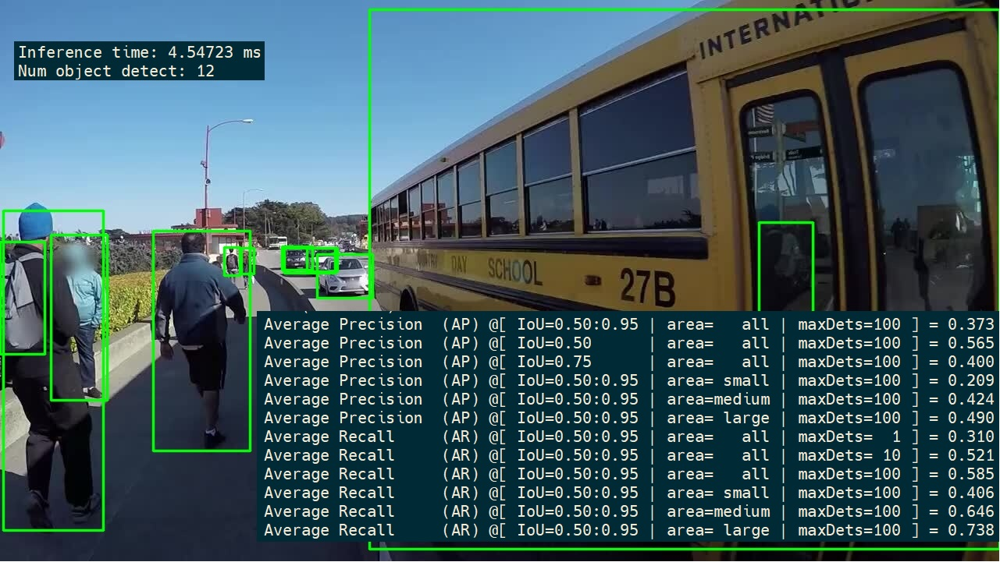

# YOLOv5 cuDLA sample

This sample demonstrates QAT training&deploying YOLOv5s on Orin DLA, which includes:
1. YOLOv5s QAT training. - see [export](./export)
2. Deploy YOLOv5s QAT model with TensorRT and cuDLA.
    - Convert QAT model to PTQ model and INT8 calibration cache. - see [export](./export)
    - Build DLA standalone loadable with TensorRT(INT8/FP16). - see [data/model](./data/model)
    - Load and run the DLA loadable with cuDLA. - see [src](./src)
3. Validate DLA performance and accuracy on COCO 2017 val dataset. - see [test_coco_map](./test_coco_map.py)


# Prerequisite

```
sudo apt update
sudo apt install libopencv-dev libjsoncpp-dev python3-pip git

# COCO tool and dataset for mAP benchmark
pip3 install pycocotools
cd data/
bash download_coco_validation_set.sh

# cmake >= 3.18
# if pre-installed cmake is lower than 3.18, src/matx_reformat/build_matx_reformat.sh
# will install it for you

```

# YOLOv5 QAT Training and ONNX Export

Refer to [export/README.md](./export/README.md).

# Build and Run

```
git clone --recursive https://github.com/NVIDIA-AI-IOT/cuDLA-samples.git
# Build INT8 and FP16 loadable from ONNX in this project
# Need to install tensorrt-safe package to build the DLA standalone loadable
bash data/model/build_dla_standalone_loadable.sh
# Build matx used in pre-/post-processing
bash src/matx_reformat/build_matx_reformat.sh
# Build YOLOv5 cuDLA app
make
```

```
# Run INT8 inference on single image
make run
# Or run COCO validation
make validate_cudla_int8 # or make validate_cudla_fp16
```

# mAP over COCO 2017

|YOLOv5s |Offical Data|DLA FP16|DLA INT8 QAT|GPU INT8 QAT|
|:----|:----|:----|:----|:----|
|mAP|[37.4](https://github.com/ultralytics/yolov5#pretrained-checkpoints)|37.5|37.1|36.8|

Note: 
1. We use inference resolution of 1x3x672x672 to get this mAP.
2. Fallback the last 4 layers to FP16 in the last head can increase mAP from 37.1 to 37.3, but the perf will drop little from 4.0ms to 4.46ms. This can be tested with a new loadble built by `bash data/model/build_dla_standalone_loadable_v2.sh `
# Performance

| Platform | GPU clock | Memory clock | DLA clock | TensorRT Version | DLA Version |
| --- | --- | --- | --- | --- | --- |
| Orin-X | 1275 MHz | 3200 MHz | 1331 MHz | 8.6 | 3.14 |

| Batch Size | DLA INT8(int8:hwc4 in + fp16:chw16 out) (ms) | GPU INT8(int8:chw32 in + fp16:chw16 out) (ms) |
| ---------- | --------------------------------------- | ---------------------------------------- |
| 1          | 3.82                              | 1.82                               |
| 2          | 7.68                             | 2.91                               |
| 4          | 15.17                             | 4.99                               |
| 8          | 30.92                              | 9.19                               |
| 12         | 46.71                             | 13.27                               |
| 16         | 62.54                             | 16.87                              |

- If we use `int8:hwc4 in + int8:chw32 out` then we can get perf of about 2.4ms(bs=1) for DLA INT8, but it will lead to small accuracy drop. We will optimize this in the future.
- The inference time(median GPU computing time) here is taken with trtexec which use some pre-launch technique to maximize the through put, so it's slightly better than the inference time measure in the pipeline.

# Notes

- This sample uses cuDLA in [hybrid mode](https://docs.nvidia.com/cuda/cuda-for-tegra-appnote/index.html#memory-model) wherein DLA can be programmed using CUDA. More cuDLA usage and material can be found [here](https://github.com/NVIDIA/Deep-Learning-Accelerator-SW/tree/main/samples/cuDLA).
- The scale used for FP32 to INT8 conversion in pre-processing is hardcoded, which value is from the first layer of the calibration cache, check [mInputScale](./src/yolov5.h) and [images: 3c00f9f4](./data/model/qat2ptq.cache). For more information about QAT, check [pytorch-quantization](https://github.com/NVIDIA/TensorRT/tree/main/tools/pytorch-quantization). For more information about quantization inside TensorRT, check [TensorRT Developer Guide](https://docs.nvidia.com/deeplearning/tensorrt/developer-guide/index.html#working-with-int8)
- Need to use below Input and Output format for cuDLA INT8 and FP16. More info about DLA I/O format can be found in **[I/O Formats on DLA](https://docs.nvidia.com/deeplearning/tensorrt/developer-guide/index.html#restrictions-with-dla)**. 
The INT8 cuDLA inference in this sample uses _INT8 Input:kDLA_LINEAR,kDLA_HWC4 + FP16 Output:kDLA_LINEAR,kCHW16_. 

| I/O          |  Format            |
| -------------| -------------------|
| INT8 Input   | kDLA_LINEAR,kDLA_HWC4,kCHW32 |
| FP16 Input   | kDLA_LINEAR,kCHW16 |
| INT8 Output  | kDLA_LINEAR,kCHW32 |
| FP16 Output  | kDLA_LINEAR,kCHW16 |

- NVIDIA reserves the right to change road map without implicit assumption of API and compatatability support
